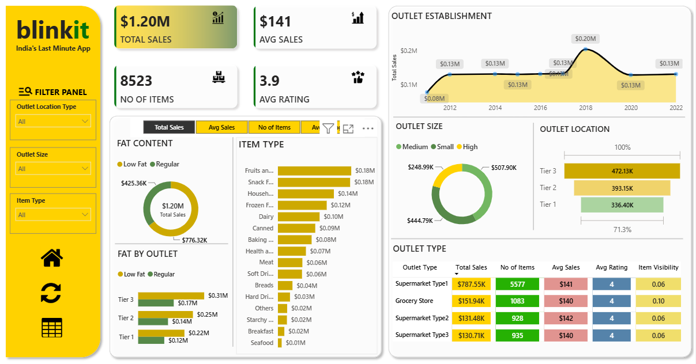
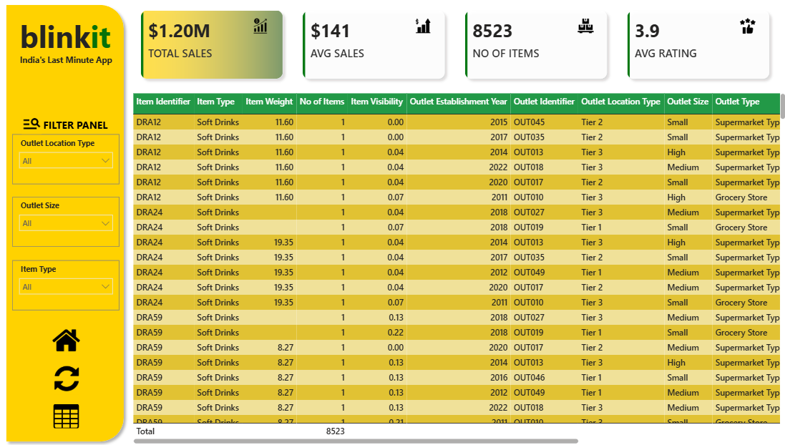

#  Blinkit Grocery Sales Analysis | Power BI Dashboard

<p align="center">
  
</p>

## Overview

This project presents an interactive Power BI dashboard built to analyze Blinkit's grocery sales performance, product contribution, outlet characteristics, customer satisfaction, and inventory visibility.

The dashboard transforms grocery sales data into a business-focused reporting solution that enables users to monitor key performance indicators, compare sales across different dimensions, and identify patterns in product and outlet performance.

The analysis is designed around key business requirements including sales performance, customer satisfaction, inventory distribution, and outlet-level performance.

---

## Business Objective

The objective of this project is to provide a clear and interactive view of Blinkit's sales performance and identify the key factors contributing to business outcomes.

The dashboard addresses the following business questions:

- What is the overall sales performance?
- Which product categories generate the highest sales?
- How does fat content contribute to total sales?
- How does sales performance vary across outlet locations?
- What percentage of sales comes from different outlet sizes?
- How has sales performance changed across outlet establishment years?
- Which outlet types perform best across key business metrics?
- How do customer ratings and item visibility vary across outlets?

---

## Key Performance Indicators

| KPI | Value |
|---|---:|
| Total Sales | $1.20M |
| Average Sales | $141 |
| Number of Items | 8,523 |
| Average Rating | 3.9 |

These KPIs provide a high-level view of revenue performance, average sales, product volume, and customer satisfaction.

---

## Dashboard Analysis

### Sales Performance

Sales performance is analyzed across multiple business dimensions:

- Item Type
- Item Fat Content
- Outlet Type
- Outlet Size
- Outlet Location
- Outlet Establishment Year

This enables users to compare sales contribution across products, outlets, and geographic segments.

### Product Performance

The dashboard provides a detailed view of product performance through:

- Product category
- Fat content
- Total sales
- Number of items
- Item visibility
- Average rating

This helps identify high-performing product categories and understand differences in product contribution.

### Outlet Performance

Outlet performance is evaluated using:

- Outlet Type
- Outlet Size
- Outlet Location Type
- Outlet Establishment Year
- Total Sales
- Average Sales
- Number of Items
- Average Rating
- Item Visibility

This provides a comprehensive view of how different outlet characteristics relate to business performance.

### Customer Satisfaction

Customer ratings are incorporated into the dashboard as a key performance indicator and are also evaluated across outlet types.

This allows sales performance to be viewed alongside customer satisfaction rather than relying only on revenue-based metrics.

---

## Key Business Insights

### Overall Performance

The dataset generates approximately **$1.20M in total sales** across **8,523 items**, with an average sales value of **$141** and an overall average rating of **3.9**.

### Product Categories

**Fruits & Vegetables** and **Snack Foods** are among the strongest-performing product categories based on total sales.

### Fat Content

**Low Fat** products contribute a larger share of total sales compared with Regular products in the analyzed dataset.

### Outlet Location

**Tier 3 outlets** generate the highest total sales among the three outlet location categories.

### Outlet Size

**Medium-sized outlets** contribute the largest share of total sales, followed by Small and High-sized outlets.

### Outlet Type

**Supermarket Type1** generates the highest total sales among the outlet types analyzed.

### Customer Satisfaction

Average ratings remain relatively consistent across outlet types, with the overall average rating at **3.9**.

### Item Visibility

Item visibility is analyzed alongside sales and outlet performance to provide additional context around product exposure and performance.

---

## Interactive Dashboard

The dashboard provides interactive filtering capabilities that allow users to explore the data dynamically.

### Available Filters

- Outlet Location Type
- Outlet Size
- Item Type

Users can combine these filters to move from a high-level business overview to more detailed product and outlet-level analysis.

---

## Dashboard Views

### Main Dashboard



The main dashboard provides an executive-level overview of sales performance, product contribution, outlet performance, and key business metrics.

### Detailed Data View



The detailed data view provides granular product and outlet-level information for deeper analysis.

---

## Tools & Technologies

| Tool | Purpose |
|---|---|
| Power BI | Dashboard development and interactive data visualization |
| DAX | KPI and analytical measure development |
| Microsoft Excel | Source dataset |
| GitHub | Project documentation and version control |

---

## Dashboard Design

The dashboard was designed with a focus on:

- Clear KPI presentation
- Business-oriented visualizations
- Consistent layout
- Interactive filtering
- Easy comparison across business dimensions
- Executive-level reporting
- Detailed data exploration

The design allows users to quickly identify important performance patterns while retaining access to detailed information when required.

---

## Project Structure

```text
Blinkit-Grocery-Data-Analysis/
│
├── Data/
│   └── BlinkIT Grocery Data.xlsx
│
├── Images/
│   ├── Blinkit-MainDashboard.png
│   ├── Blinkit-Table.png
│   ├── Avg Sales.png
│   ├── Items.png
│   ├── Sales.png
│   ├── Rating.png
│   ├── filter.png
│   ├── home.png
│   └── refresh.png
│
├── Blinkit Dashboard.pbit
│
├── LICENSE
│
└── README.md
